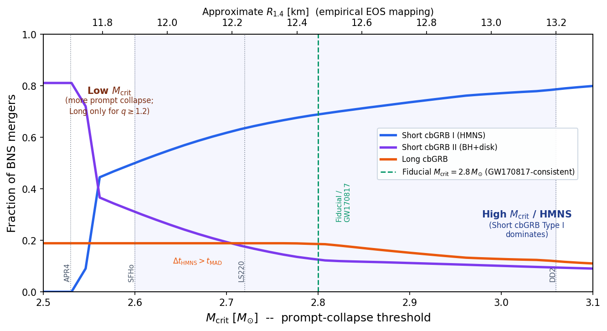
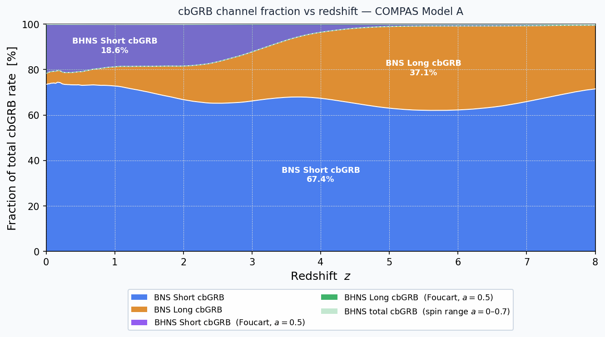
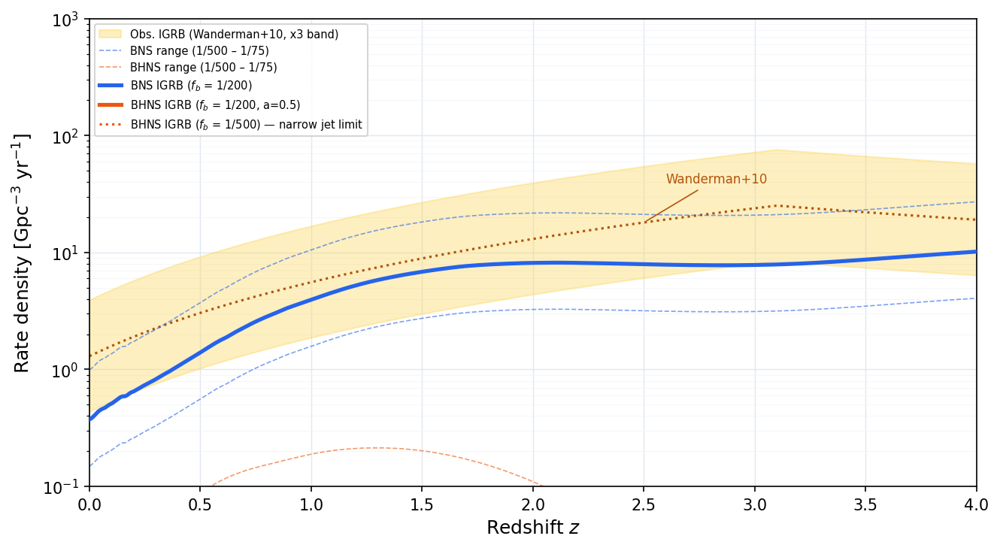

# GRB Classification from Compact Binary Mergers
### Using COMPAS Population Synthesis to Predict Short and Long cbGRB Rates

This project applies the [Gottlieb et al. (2023)](https://arxiv.org/abs/2309.00038) classification scheme to COMPAS binary population synthesis simulations (Model A, [Broekgaarden et al. 2021](https://arxiv.org/abs/2112.05763)). It predicts the rates, mass distributions, and redshift evolution of all GRB types produced by BNS and BHNS mergers, with uncertainty estimates across NS equation of state, BH spin, and binary physics models.

BHNS remnant disk masses are computed with the [Foucart et al. (2018)](https://arxiv.org/abs/1807.00011) fitting formula (Eq. 4 & 6), with a 0.01 M_sun minimum disk mass floor for jet launching.

---

## Results

### 1. GRB Class Fractions: BNS vs BHNS


About 92% of BHNS mergers produce no GRB: the neutron star either plunges directly into the black hole or forms a sub-threshold disk (M_disk < 0.01 M_sun). Of the ~8% that do disrupt sufficiently, nearly all produce Short cbGRBs (small disk); Long cbGRBs from BHNS are negligible at the fiducial spin a = 0.5. BNS mergers are 100% GRB-capable under the Gottlieb scheme (an optimistic upper bound), split ~75% Short / ~25% Long.

---

### 2. BHNS GRB Classification by BH Spin


BH mass vs NS mass colored by GRB class at spin values a = 0.0, 0.5, 0.7. Higher spin moves the ISCO inward, dramatically expanding the tidally-disrupted region and converting GRB-dark systems into Short and Long cbGRB producers. At a = 0 virtually no systems disrupt; at a = 0.7 about 14% produce Short cbGRBs and 1.2% produce Long cbGRBs. The horizontal gap is the NS remnant mass gap from the rapid supernova engine.

---

### 3. EOS Sensitivity: Short/Long Fraction vs M_crit



BNS GRB class fractions as a function of the prompt-collapse threshold M_crit, mapped to approximate NS radius R_1.4 on the upper axis. As the EOS stiffens (higher M_crit), more mergers form HMNS remnants (Short cbGRB Type I) rather than promptly collapsing to a BH. Vertical lines mark four published EOS models; the green dashed line is the GW170817-consistent fiducial at 2.8 M_sun.

---

### 4. cbGRB Channel Fraction vs Redshift



Stacked area chart showing what fraction of the total cbGRB rate comes from each of the four channels -- BNS Short, BNS Long, BHNS Short, and BHNS Long -- as a function of redshift (z = 0-8). BNS Short cbGRBs dominate at all epochs (~62-74%). BNS Long cbGRBs grow from ~5% at z = 0 to ~37% at z = 6 as lower metallicities at high redshift produce heavier neutron stars that exceed the prompt-collapse threshold. BHNS Short cbGRBs contribute ~18-22% at z < 2 but fade at high redshift as more massive BHs make tidal disruption harder. BHNS Long cbGRBs are negligible (<0.2%) at the fiducial spin. The shaded band shows the BHNS spin uncertainty range (a = 0 to 0.7).

---

### 5. Predicted vs Observed Long GRB Rates



Predicted BNS and BHNS long cbGRB rate densities compared to the observed long GRB rate from Wanderman & Piran (2010), corrected for beaming fraction (f_b = 1/200 fiducial). The BNS long cbGRB channel alone can account for the observed rate at z > 1. The BHNS contribution is sub-dominant but non-negligible at high spin. Dashed lines show the beaming uncertainty range (f_b = 1/500 to 1/75).

---

### 6. Formation Efficiency vs Metallicity


Formation efficiency (mergers per M_sun of star formation) as a function of progenitor metallicity Z for all BNS and BHNS GRB channels. BHNS formation peaks at Z ~ 10^-3 and drops sharply near solar metallicity. BNS formation is more metallicity-independent. The BHNS Short cbGRB channel (purple dashed) traces the BHNS total at sub-solar metallicities, reflecting the large fraction of disruptions that produce only small disks.

---

## Classification Scheme

[Gottlieb et al. (2023)](https://arxiv.org/abs/2309.00038) propose a unified picture where GRB class is set by the merger remnant.

**BNS mergers:**

| Type | Class | Condition | Engine |
|---|---|---|---|
| Type I sGRB | Short cbGRB | M_tot < M_crit (~2.8 M_sun) | HMNS remnant powers jet before collapse |
| Type II sGRB | Short cbGRB | M_tot >= M_crit, q < 1.2 | Immediate BH + light accretion disk |
| lGRB | Long cbGRB | M_tot >= M_crit, q >= 1.2 | BH + massive disk from asymmetric merger |

**BHNS mergers** (disk mass from [Foucart et al. 2018](https://arxiv.org/abs/1807.00011) Eq. 4 & 6):

| Type | Class | Condition |
|---|---|---|
| No disruption / sub-threshold | No GRB | NS plunges or M_disk < 0.01 M_sun |
| sGRB | Short cbGRB | 0.01 <= M_disk < 0.1 M_sun |
| lGRB | Long cbGRB | M_disk >= 0.1 M_sun |

---

## Analysis Pipeline

Run notebooks in order: `GRB_BNS.ipynb` -> `GRB_BHNS.ipynb` -> `GRB_CosmicRate.ipynb` -> `GRB_comparsion.ipynb`. The cosmic rate notebook depends on `.npy` files exported by the first two.

| Notebook | Contents |
|---|---|
| `GRB_BNS.ipynb` | BNS classification, efficiency, M_crit and q sensitivity, Model A vs K |
| `GRB_BHNS.ipynb` | BHNS classification via Foucart et al. (2018), spin sensitivity, EOS sensitivity |
| `GRB_CosmicRate.ipynb` | Cosmic integration, rate vs redshift, 4-channel cbGRB fractions, comparison with observed rates |
| `GRB_comparsion.ipynb` | BNS vs BHNS class fractions, formation efficiency vs metallicity, metallicity-delay time scatter |

**Data sources:**
- BNS: [Zenodo 5189849](https://zenodo.org/records/5189849)
- BHNS: [Zenodo 5178777](https://zenodo.org/records/5178777)

Data files (`.h5`, `.hdf5`) are not included. Download from the Zenodo links above before running.

---

## Setup

```bash
conda create -n grb-env python=3.10
conda activate grb-env
python -m pip install -r requirements.txt
python -m ipykernel install --user --name grb-env --display-name "GRB (grb-env)"
```

---

## References

- Gottlieb et al. (2023): [arXiv:2309.00038](https://arxiv.org/abs/2309.00038)
- Foucart et al. (2018): [arXiv:1807.00011](https://arxiv.org/abs/1807.00011)
- Broekgaarden et al. (2021): [arXiv:2112.05763](https://arxiv.org/abs/2112.05763)
- Neijssel et al. (2019): Metallicity-specific star formation rate density
- Wanderman & Piran (2010): Observed long GRB luminosity function and rate

---

## License

MIT License. See [LICENSE](LICENSE) for details.
