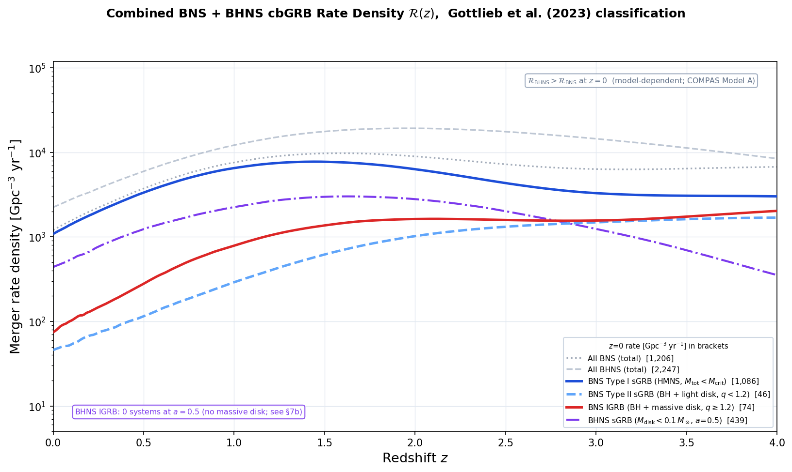
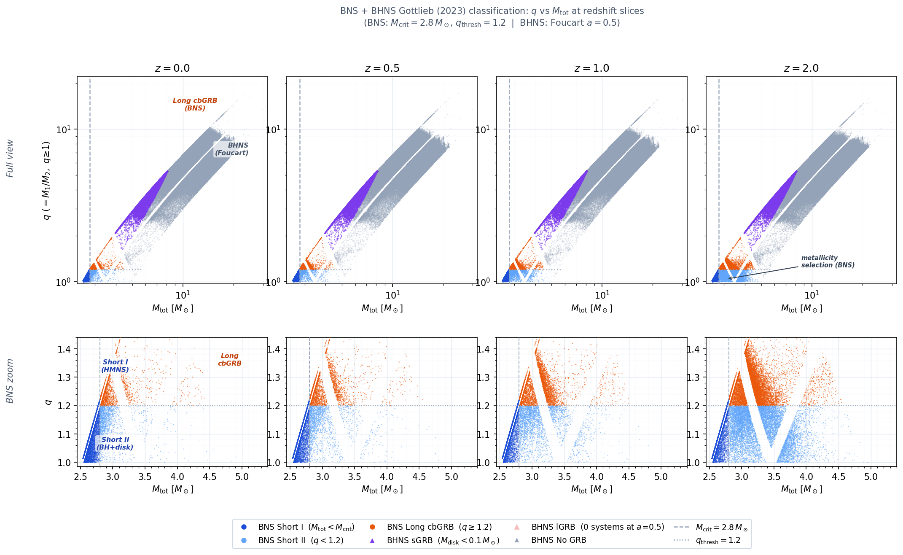
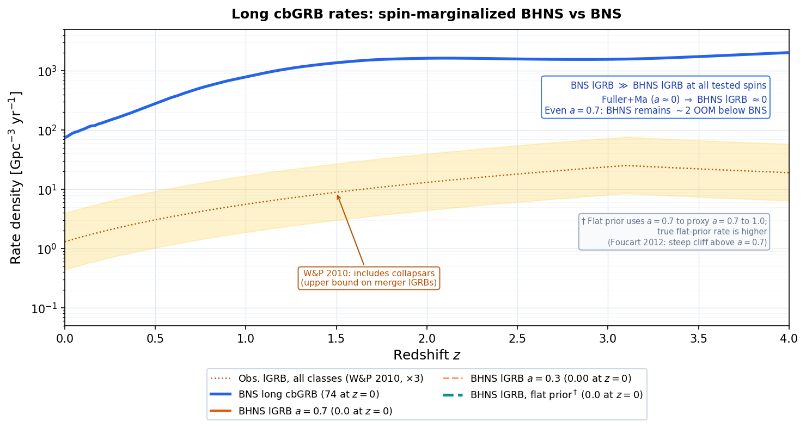

# GRB Classification from Compact Binary Mergers
### Using COMPAS Population Synthesis to Predict Short and Long cbGRB Rates

This project applies the [Gottlieb et al. (2023)](https://arxiv.org/abs/2309.00038) classification scheme to COMPAS binary population synthesis simulations (Model A, [Broekgaarden et al. 2021](https://arxiv.org/abs/2112.05763)). It predicts the rates, mass distributions, and redshift evolution of all GRB types produced by BNS and BHNS mergers, with uncertainty estimates across NS equation of state, BH spin, and binary physics models.

**BHNS disk masses:** The [Foucart et al. (2018)](https://arxiv.org/abs/1807.00011) fitting formula (Eq. 4 and 6) gives total remnant baryon mass $M_{\rm rem}$ (Foucart 2012, Sec. VI). Before applying Gottlieb thresholds, the code maps $M_{\rm rem}$ to disk mass with a **smooth sigmoid** fraction $f_{\rm disk}(M_{\rm rem}) = 0.3 + 0.2/(1 + \exp(-(M_{\rm rem} - 0.1)/0.02))$ (asymptotes $\sim 0.3$ and $\sim 0.5$; scale $0.02\,M_\odot$), then $M_{\rm disk} = f_{\rm disk}\,M_{\rm rem}$. Since the specific sigmoid parameters are not from a published calibration, **sensitivity to constant $f_{\rm disk} = 1/3$ and $1/2$** is shown in both `GRB_BHNS.ipynb` and `GRB_CosmicRate.ipynb`. Jet-launching uses a **$0.01\,M_\odot$** minimum on $M_{\rm disk}$.

**BNS rates:** Cosmic rates optionally scale BNS weights by a GRB efficiency $\varepsilon_{\rm grb}$ (fiducial 1.0; e.g. 0.7 for sensitivity). The comparison notebook still shows BNS class fractions under the Gottlieb scheme with no explicit failed-jet channel.

---

## Results

### 1. Combined BNS + BHNS Rate Density



All Gottlieb et al. (2023) cbGRB channels on a single axis: BNS Type I sGRB (HMNS), Type II sGRB (BH + light disk), Long cbGRB (BH + massive disk, $q \geq 1.2$), and BHNS sGRB ($a = 0.5$). At the fiducial spin, BHNS long cbGRB is zero (Foucart 2012: insufficient spin for massive disk formation). BNS short cbGRB dominates at all redshifts. COMPAS Model A, MSSFR from Neijssel et al. (2019).

---

### 2. BHNS GRB Classification by BH Spin


BH mass vs NS mass colored by GRB class at $a = 0.0,\,0.3,\,0.5,\,0.7$. Higher spin moves the ISCO inward, expanding the tidally disrupted region. At $a \approx 0$ almost no systems disrupt; at higher spin a larger fraction can produce Short or Long cbGRBs. The $a = 0.3$ panel captures the steep disruption cliff between $a = 0$ and $a = 0.5$, improving quadrature accuracy for spin marginalization. The horizontal gap is the NS remnant mass gap from the rapid supernova engine. Natal BH spins are not taken from COMPAS; see spin-marginalized rates below.

---

### 3. cbGRB Channel Fraction vs Redshift


Stacked fractions of the total cbGRB rate from four channels (BNS Short, BNS Long, BHNS Short, BHNS Long) vs redshift. BNS Short (~80% at $z = 0$) dominates at all epochs. BNS Long grows at high $z$ as lower metallicity promotes asymmetric mergers ($q \geq 1.2$; Rastinejad et al. 2025). BHNS Short contributes ~15% at low $z$, while BHNS Long is zero at $a = 0.5$ (Foucart 2012). A teal shaded band brackets the spin uncertainty ($a = 0.0$ to $0.7$) on the BNS/BHNS boundary.

---

### 4. Intrinsic Long cbGRB Rate vs Observed lGRB Rate


Predicted intrinsic BNS long cbGRB merger rate compared with the beaming-corrected long GRB rate from Wanderman and Piran (2010). The predicted rate exceeds the observed total lGRB rate (which includes collapsars) by ~50 to 100x, implying $\varepsilon_{\rm grb}^{\rm long} \ll 1$. BHNS long cbGRB is gated: at $a = 0.5$ it is zero and not plotted. The W&P band is an upper bound on merger-driven lGRBs since it includes the dominant collapsar population.

---

### 5. BNS + BHNS Classification Plane at Redshift Slices



Gottlieb et al. (2023) classification diagram ($q$ vs $M_{\rm tot}$) at four redshift slices ($z = 0, 0.5, 1, 2$). Top row shows the full view (BNS + BHNS, log scale); bottom row zooms into the BNS region (linear scale). Classification boundaries at $M_{\rm crit} = 2.8\,M_\odot$ and $q = 1.2$ separate the three BNS outcomes. BHNS sGRB systems (purple triangles) appear at high $M_{\rm tot}$ and $q$; BHNS lGRB has zero systems at $a = 0.5$.

---

### 6. Spin-Marginalized BHNS Long cbGRB Rates



Long cbGRB rate densities with marginalized BH spin priors: a flat prior on $a \in [0, 1]$ (trapezoidal weights over the 4-point spin grid $a = \{0.0, 0.3, 0.5, 0.7\}$) and a Fuller and Ma (2019) low-spin prior (all weight on $a \approx 0$). Even with the optimistic flat prior (a lower bound, since $a = 0.7$ proxies for $a = 0.7$ to $1.0$), BHNS long cbGRB remains orders of magnitude below BNS. Under Fuller and Ma (2019), BHNS long cbGRBs are negligible.

---

## Classification Scheme

[Gottlieb et al. (2023)](https://arxiv.org/abs/2309.00038) tie GRB class to the merger remnant.

**BNS mergers:**

| Type | Class | Condition | Engine |
|---|---|---|---|
| Type I sGRB | Short cbGRB | $M_{\rm tot} < M_{\rm crit}$ (~$2.8\,M_\odot$) | HMNS remnant powers jet before collapse |
| Type II sGRB | Short cbGRB | $M_{\rm tot} \geq M_{\rm crit}$, $q < 1.2$ | Immediate BH + light accretion disk |
| lGRB | Long cbGRB | $M_{\rm tot} \geq M_{\rm crit}$, $q \geq 1.2$ | BH + massive disk from asymmetric merger |

**BHNS mergers** (Foucart $M_{\rm rem}$ from [Foucart et al. 2018](https://arxiv.org/abs/1807.00011) Eq. 4 and 6, then sigmoid $M_{\rm rem} \to M_{\rm disk}$ as above):

| Type | Class | Condition |
|---|---|---|
| No disruption / sub-threshold | No GRB | NS plunges or $M_{\rm disk} < 0.01\,M_\odot$ |
| sGRB | Short cbGRB | $0.01 \leq M_{\rm disk} < 0.1\,M_\odot$ |
| lGRB | Long cbGRB | $M_{\rm disk} \geq 0.1\,M_\odot$ |

**Conventions:** BNS uses $q = M_{\max}/M_{\min} \ge 1$. BHNS uses $Q = M_{\rm BH}/M_{\rm NS}$ in the Foucart parameterisation (consistent with Gottlieb Fig. 2).

---

## Analysis Pipeline

Run notebooks in order: `GRB_BNS.ipynb` -> `GRB_BHNS.ipynb` -> `GRB_CosmicRate.ipynb` -> `GRB_comparison.ipynb`. The cosmic rate notebook uses `.npy` exports from the first two where applicable.

| Notebook | Contents |
|---|---|
| `GRB_BNS.ipynb` | BNS classification, efficiency, weighted $M_{\rm crit}$ and $q$-threshold sensitivity, Model A vs K |
| `GRB_BHNS.ipynb` | BHNS classification (Foucart + remnant-to-disk), spin, EOS, and $f_{\rm disk}$ sensitivity |
| `GRB_CosmicRate.ipynb` | MSSFR cosmic integration, 4-channel fractions, W&P comparison, $\varepsilon_{\rm grb}$ sensitivity, $f_{\rm disk}$ rate sensitivity, spin-marginalized BHNS rates (4-point grid), Model K vs A normalization check |
| `GRB_comparison.ipynb` | BNS vs BHNS class fractions, efficiency vs metallicity, metallicity vs delay time |

**Data sources:**
- BNS: [Zenodo 5189849](https://zenodo.org/records/5189849)
- BHNS: [Zenodo 5178777](https://zenodo.org/records/5178777)

Data files (`.h5`, `.hdf5`) are not included. Download from Zenodo before running.

---

## Setup

```bash
conda create -n grb-env python=3.10
conda activate grb-env
python -m pip install -r requirements.txt
python -m ipykernel install --user --name grb-env --display-name "GRB (grb-env)"
```

---

## References

- Gottlieb et al. (2023): [arXiv:2309.00038](https://arxiv.org/abs/2309.00038)
- Foucart et al. (2018): [arXiv:1807.00011](https://arxiv.org/abs/1807.00011)
- Foucart (2012): remnant mass vs disk mass discussion (Phys. Rev. D 86, 124007)
- Broekgaarden et al. (2021): [arXiv:2112.05763](https://arxiv.org/abs/2112.05763)
- Neijssel et al. (2019): Metallicity-specific star formation rate density
- Wanderman and Piran (2010): Long GRB rate and luminosity function
- Fuller and Ma (2019): Natal BH spins in isolated binaries (spin priors for marginalized rates)
- Rastinejad et al. (2025): Merger-driven long GRBs and asymmetric compact object binaries

---

## License

MIT License. See [LICENSE](LICENSE) for details.
