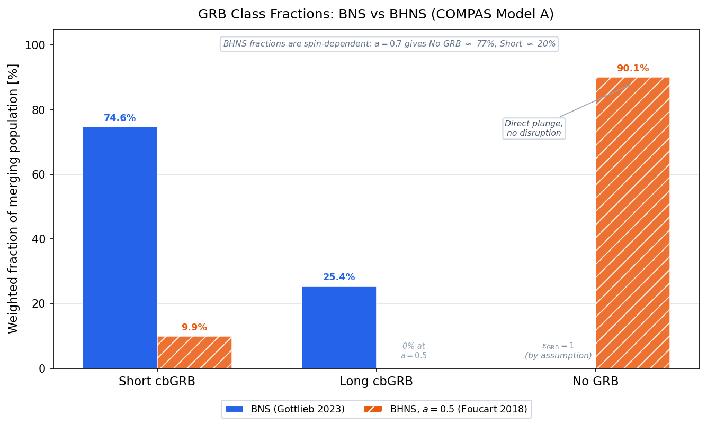
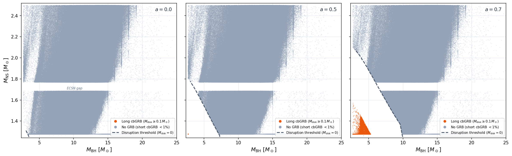
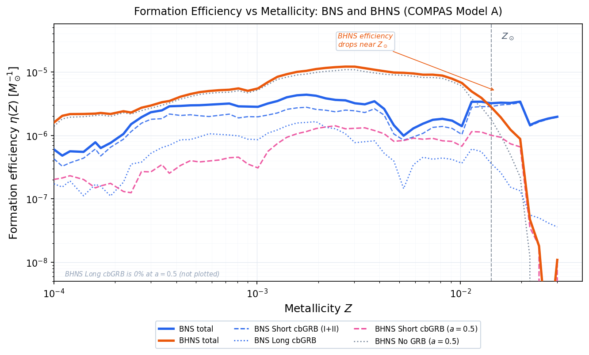
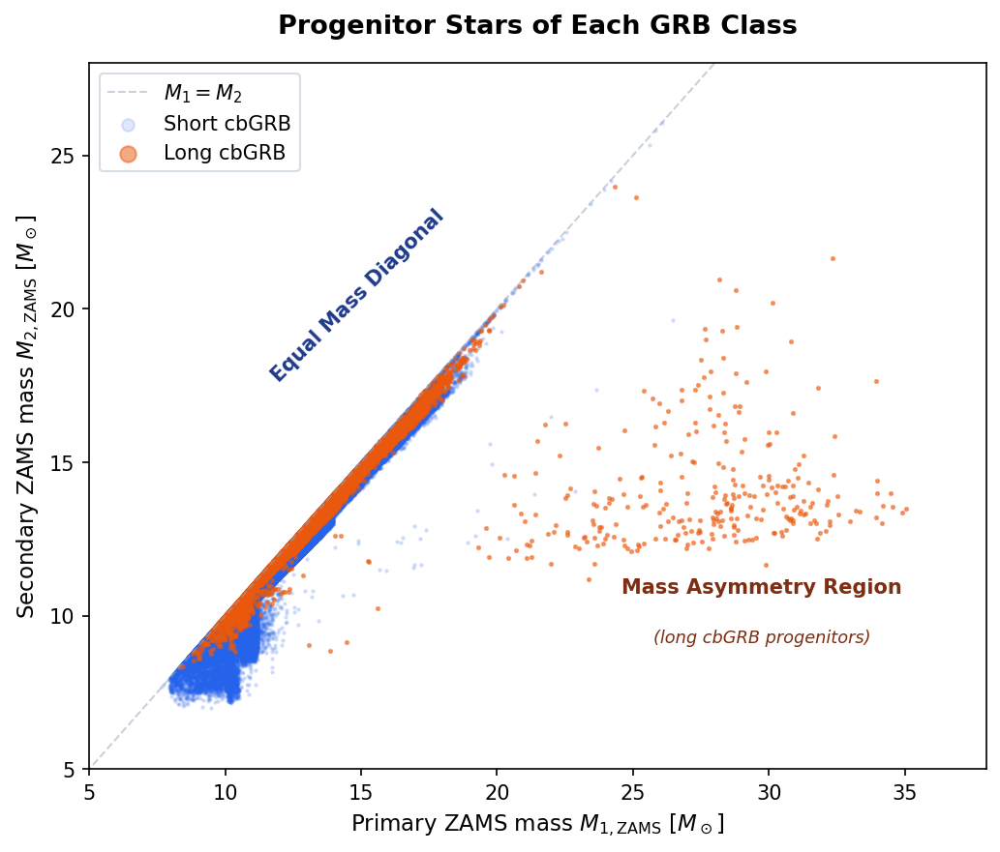
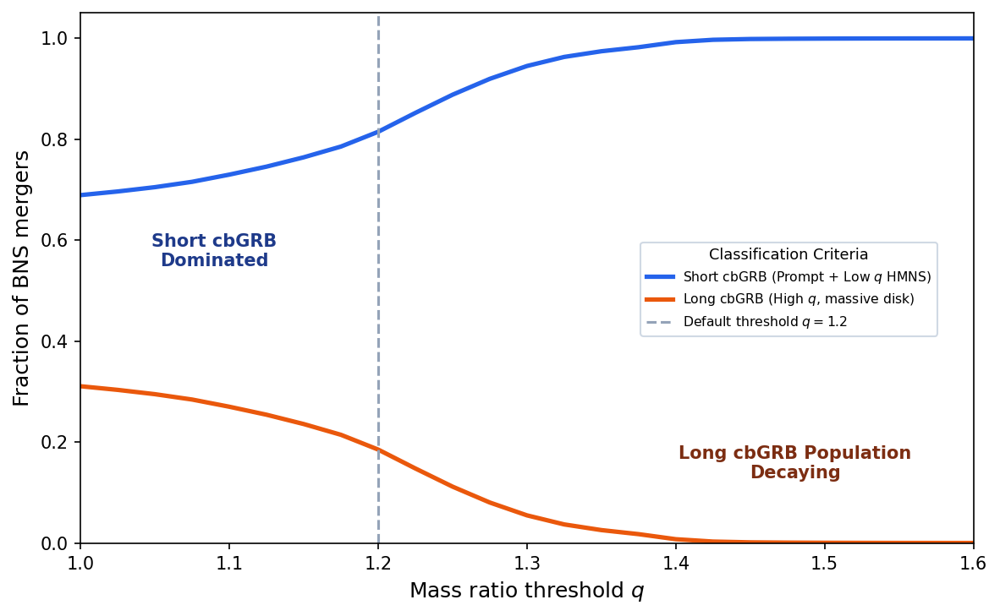

# GRB Classification from Compact Binary Mergers
### Using COMPAS Population Synthesis to Predict Short and Long cbGRB Rates

This project applies the [Gottlieb et al. (2023)](https://arxiv.org/abs/2309.00038) GRB classification scheme to COMPAS binary population synthesis simulations. The analysis predicts the rates, mass distributions, and redshift evolution of all compact binary GRB types produced by BNS and BHNS mergers, including uncertainty estimates across binary physics models, NS equation of state, and BH spin.

---

## Results

### GRB Class Fractions: BNS vs BHNS


*~92% of BHNS mergers produce no GRB (NS plunges without tidal disruption), while BNS mergers are predominantly GRB-capable. The dominant result of the analysis.*

### BHNS GRB Classification by BH Spin


*M_BH vs M_NS colored by GRB class for a = 0.0, 0.5, 0.7. Higher spin dramatically expands the tidally-disrupted region, shifting systems from GRB-dark to long cbGRB.*

### BNS vs BHNS Formation Efficiency vs Metallicity


*BHNS mergers dominate total formation efficiency but contribute minimally to GRBs. BNS mergers, despite lower total rates, drive the cbGRB signal.*

### Progenitor Stars of Each GRB Class


*ZAMS primary vs secondary mass for each GRB class. Long cbGRB progenitors are highly asymmetric (scattered at high mass ratios); short cbGRB progenitors cluster tightly on the equal-mass diagonal.*

### Sensitivity to Mass Ratio Classification Boundary


*GRB class fractions as a function of the q = 1.2 threshold. Results are robust across a wide range of threshold values, confirming the classification is not sensitive to the exact boundary.*

---

## Scientific Background

Gravitational wave detections (GW170817, GW211211A) suggest that both short and long GRBs can be produced by compact binary mergers. Gottlieb et al. (2023) propose a unified hybrid scenario where the GRB class is determined by the merger remnant. Five physically distinct outcomes are identified (Figure 2 of the paper):

**BNS mergers:**

| Type | GRB Class | Condition | Engine |
|---|---|---|---|
| Type I sGRB | Short cbGRB | M_tot < M_crit (~2.8 M_sun) | HMNS remnant powers jet before collapse |
| Type II sGRB | Short cbGRB | M_tot >= M_crit, q < 1.2 | Immediate BH + light accretion disk |
| lGRB | Long cbGRB | M_tot >= M_crit, q >= 1.2 | BH + massive disk from asymmetric merger |

**BHNS mergers** (outcome depends on NS tidal disruption via Foucart 2012):

| Type | GRB Class | Condition |
|---|---|---|
| No disruption | No GRB | NS plunges into BH without disk formation |
| sGRB | Short cbGRB | NS disrupted, small disk (M_disk < 0.1 M_sun) |
| lGRB | Long cbGRB | NS disrupted, massive disk (M_disk >= 0.1 M_sun) |

A physical disruption pre-check (Roche lobe radius vs ISCO radius) is applied to the Foucart formula before computing disk mass.

---

## Analysis Pipeline

### Phase 1 - Data and Validation

- **Data source:** COMPAS BNS fiducial simulation from [Zenodo 5189849](https://zenodo.org/records/5189849); BHNS from [Zenodo 5178777](https://zenodo.org/records/5178777)
- **Validation:** Formation efficiency vs metallicity (roughly flat for BNS, as expected)
- **Mass plane:** M_1 vs M_2 scatter plot for all merging systems, colored by GRB class
- **Notebooks:** `GRB_BNS.ipynb`, `GRB_BHNS.ipynb`

### Phase 2 - GRB Classification

**BNS** (`GRB_BNS.ipynb`): Gottlieb et al. (2023) Figure 2 applied to each merging system:

```
M_tot < 2.8 M_sun                   -> Type I sGRB   (HMNS-powered)
M_tot >= 2.8 M_sun  and  q < 1.2   -> Type II sGRB  (BH + light disk)
M_tot >= 2.8 M_sun  and  q >= 1.2  -> lGRB           (BH + massive disk)
```

**BHNS** (`GRB_BHNS.ipynb`): Foucart (2012) disk mass formula with disruption pre-check:

```
No tidal disruption (NS plunges)      -> no GRB
0 < M_disk < 0.1 M_sun (small disk)  -> sGRB
M_disk >= 0.1 M_sun    (large disk)  -> lGRB
```

BH spin is a free parameter: `a = 0.0`, `0.5`, `0.7` (three separate classifications).

### Phase 3 - Formation Efficiency and Class Fractions

For each metallicity grid point (weighted by STROOPWAFEL sampling):

- Total formation efficiency vs metallicity (matches demo notebook baseline)
- Formation efficiency split by all GRB classes
- GRB class fraction vs metallicity

Sensitivity analyses in `GRB_BNS.ipynb`:
- M_crit sweep from 2.6 to 3.0 M_sun (NS EOS uncertainty)
- Mass ratio threshold sweep around q = 1.2
- Model A vs Model K binary physics comparison (efficiency)

Sensitivity analyses in `GRB_BHNS.ipynb`:
- Spin sensitivity: long cbGRB efficiency for a = 0.0, 0.5, 0.7
- EOS sensitivity: classification fraction vs NS radius (9 to 13 km, a = 0)

### Phase 4 - Cosmic Integration

**Notebook:** `GRB_CosmicRate.ipynb`

Convolves formation efficiencies and delay-time distributions with the Neijssel et al. (2019) metallicity-specific star formation rate density. A custom `compute_merger_rate` function accumulates contributions in O(n_z) memory rather than allocating a full (n_binaries x n_redshifts) array.

Rate curves computed for all five Figure 2 classes:
- BNS: Type I sGRB, Type II sGRB, lGRB, All BNS
- BHNS: sGRB (a=0.5), lGRB (a=0.5), All BHNS

Key plots:
- Merger rate density vs redshift for each BNS class
- Combined two-panel BNS + BHNS comparison
- Unified single-axis Figure 2 plot: all five cbGRB classes on one axis
- BNS mass plane and M_tot histograms at redshift slices z = 0, 0.5, 1.0, 2.0 (rate-weighted)
- GRB class fraction vs continuous redshift (z = 0 to 5)

Exported arrays: `results/rates_BNS.npy`, `results/rates_BHNS.npy`

### Phase 5 - Uncertainties

Three uncertainty axes explored in `GRB_CosmicRate.ipynb`:

| Axis | Parameter range | Output |
|---|---|---|
| BH spin (BHNS) | a = 0.0, 0.5, 0.7 | Long cbGRB rate vs redshift for each spin |
| NS EOS (BNS) | M_crit = 2.6, 2.8, 3.0 M_sun | Short and long cbGRB rates vs redshift |
| Binary physics (BNS) | Model A (fiducial) vs Model K | Rate comparison with shaded uncertainty band |

---

## Repository Structure

```
GRBproject/
├── GRB_BNS.ipynb            # BNS classification, efficiency, and sensitivity analysis
├── GRB_BHNS.ipynb           # BHNS classification, spin and EOS sensitivity
├── GRB_CosmicRate.ipynb     # Cosmic integration, Figure 2 rates, redshift distributions
├── GRB_comparsion.ipynb     # Summary comparison: BNS vs BHNS class fractions and rates
├── results/
│   ├── eff_BNS.npy          # Formation efficiency arrays (BNS, by metallicity)
│   ├── eff_BHNS.npy         # Formation efficiency arrays (BHNS, by metallicity)
│   ├── rates_BNS.npy        # Merger rate density vs redshift (BNS)
│   └── rates_BHNS.npy       # Merger rate density vs redshift (BHNS)
├── plots/                   # All figures saved automatically on notebook execution
├── Demos/                   # Reference notebooks from Broekgaarden et al.
├── Papers/                  # Gottlieb et al. 2023 and related literature
├── requirements.txt         # Python dependencies
└── README.md
```

Data files (`.h5`, `.hdf5`) are excluded from this repo. Download from the Zenodo links above.

---

## Setup

```bash
# Create and activate the conda environment
conda create -n grb-env python=3.10
conda activate grb-env
python -m pip install -r requirements.txt

# Register kernel with Jupyter
python -m ipykernel install --user --name grb-env --display-name "GRB (grb-env)"
```

Run notebooks in order: `GRB_BNS.ipynb` -> `GRB_BHNS.ipynb` -> `GRB_CosmicRate.ipynb` -> `GRB_comparsion.ipynb`. The cosmic rate and comparison notebooks depend on `.npy` files exported by the first two. All plots are saved to `plots/` automatically when cells are executed.

---

## Key References

- Gottlieb et al. (2023) - Full GRB classification scheme: [arXiv:2309.00038](https://arxiv.org/abs/2309.00038)
- Broekgaarden et al. (2021) - COMPAS BHNS population synthesis: [arXiv:2112.05763](https://arxiv.org/abs/2112.05763)
- Foucart (2012) - NS tidal disruption fitting formula for BHNS remnant disk mass
- Neijssel et al. (2019) - Metallicity-specific star formation rate density model used in cosmic integration

---

## Glossary

| Term | Definition |
|---|---|
| BNS | Binary Neutron Star |
| BHNS | Black Hole - Neutron Star binary |
| cbGRB | Compact Binary Gamma-Ray Burst |
| sGRB | Short GRB (duration < 2 s) |
| lGRB | Long GRB (duration > 2 s) |
| HMNS | Hypermassive Neutron Star |
| DCO | Double Compact Object |
| ZAMS | Zero Age Main Sequence |
| SFRD | Star Formation Rate Density |
| LVK | LIGO-Virgo-KAGRA collaboration |
| M_crit | Critical total mass threshold for HMNS collapse (~2.8 M_sun) |
| q | Mass ratio = max(M1, M2) / min(M1, M2) |
| ISCO | Innermost Stable Circular Orbit |
| M_disk | Remnant accretion disk mass (Foucart 2012 formula) |

---

## License

This project is licensed under the MIT License. See [LICENSE](LICENSE) for details.
