# GRB Classification from Compact Binary Mergers
### Population-Level Predictions for Merger-Driven Short and Long GRBs

This project applies the [Gottlieb et al. (2023)](https://arxiv.org/abs/2309.00038) and [Gottlieb et al. (2024)](https://arxiv.org/abs/2411.13657v2) GRB classification frameworks to COMPAS binary population synthesis simulations (Model A, [Broekgaarden et al. 2022](https://arxiv.org/abs/2112.05763)). Starting from the mass-plane diagnostics that connect merger remnant physics to GRB type, the analysis progresses through population synthesis, cosmic integration, kinematic offsets, and parameter space exploration to produce the first comprehensive population-level predictions for merger-driven long and short GRBs.

**2024 update:** The Gottlieb et al. (2024) hybrid model refines the sub-threshold BNS region by splitting it according to HMNS lifetime: long-lived HMNS ($M_\mathrm{tot} \lesssim 1.2\,M_\mathrm{TOV}$) powers sbGRB + blue KN, while short-lived HMNS collapses to a BH with massive disk, powering lbGRB + red KN. Kilonova color (red vs blue) becomes the key diagnostic for the central engine.

---

## Project Structure

All analysis is consolidated in a single notebook backed by five reusable Python modules:

| File | Purpose |
|---|---|
| **`GRB_Main.ipynb`** | Main research notebook (21 sections, see below) |
| `grb_physics.py` | Core physics: Foucart disk mass, NS helpers, ISCO, EOS constants, Gottlieb thresholds |
| `grb_classify.py` | Classification: BNS 2023/2024 schemes, BHNS Foucart, unified grid, formation channels |
| `grb_rates.py` | Cosmic rates: MSSFR convolution, per-system weights, efficiency, spin marginalization |
| `grb_io.py` | Data I/O: HDF5 loading (BNS/BHNS with channels and kicks), export helpers, plotting utilities |
| `grb_offsets.py` | Host-galaxy offsets: Hernquist potential orbit integration, projected offset CDFs |

Archived notebooks from earlier development are in `archive/`.

---

## Notebook Sections

### Part I: Mass-Plane Diagnostics (Sections 1 to 6)

| Section | Plot | Description |
|---|---|---|
| 1. BNS Mass Plane | 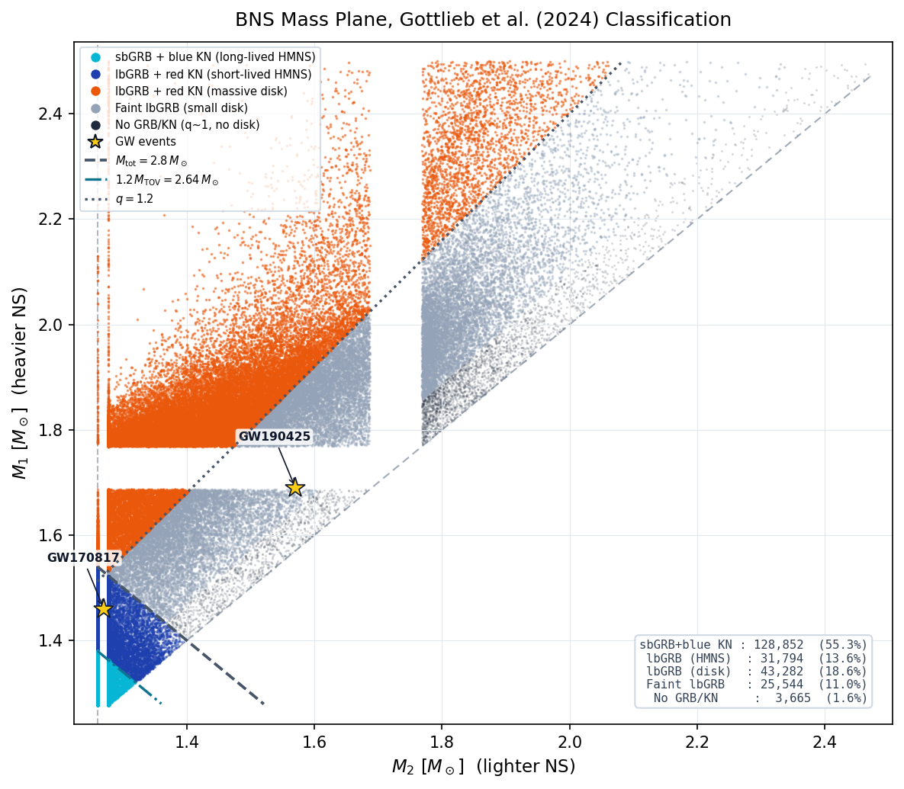 | BNS scatter in the $M_2$ vs $M_1$ plane with Gottlieb 2024 four-class boundaries, GW170817/GW190425 markers |
| 2. Unified Mass Plane | 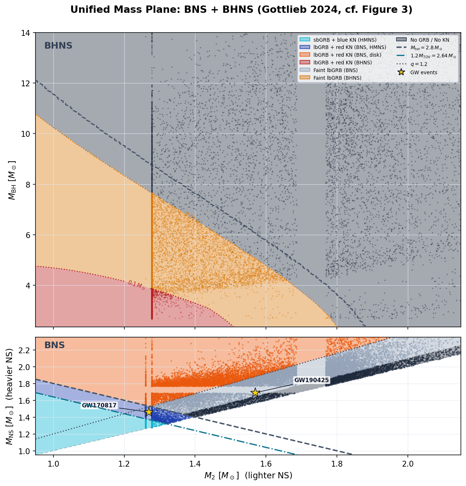 | Combined BNS + BHNS grid spanning all merger outcomes (cf. Gottlieb 2024 Fig. 3) |
| 3. Ejecta vs Duration | 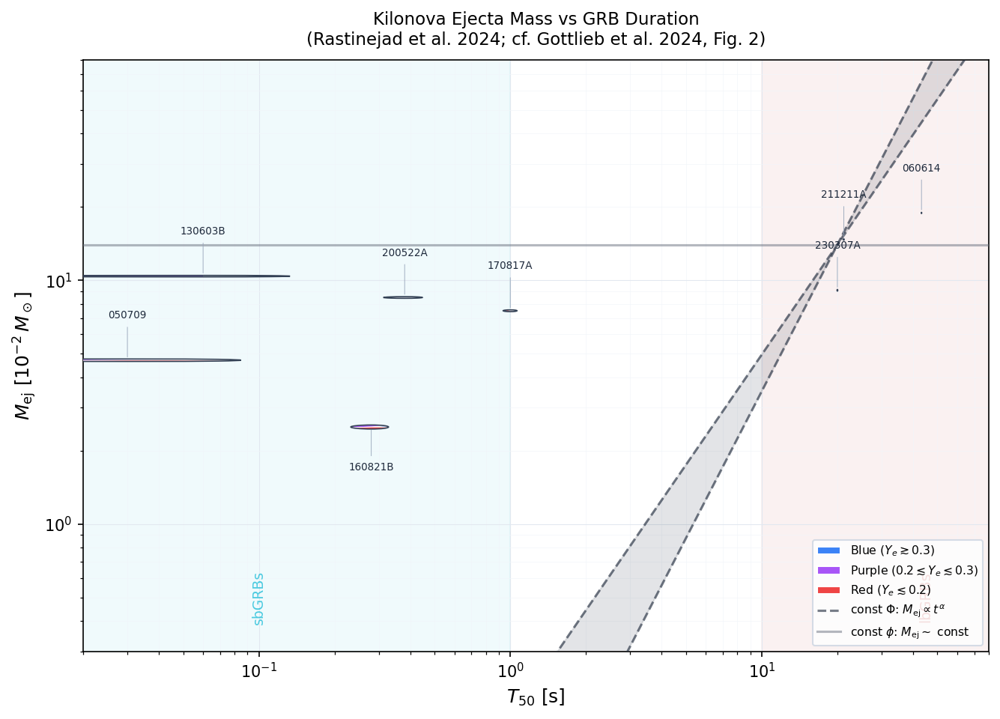 | Observed GRB/KN sample: kilonova ejecta mass vs GRB duration with engine diagnostic bands |
| 4. Side-by-Side Panels | 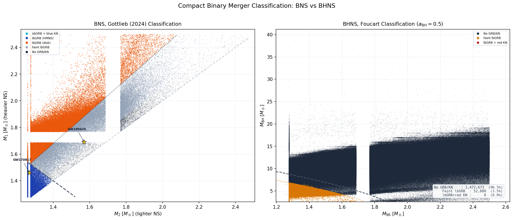 | Left: BNS four-class plane. Right: BHNS with Foucart disk mass contours |
| 5. 2023 vs 2024 Fractions | 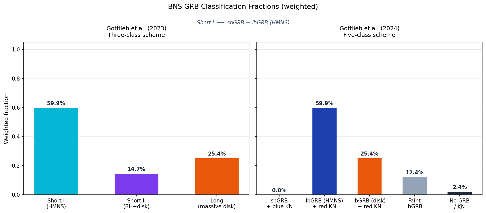 | How the BNS population redistributes between the three-class and five-class schemes |
| 6. $M_\mathrm{thresh}$ Sensitivity | 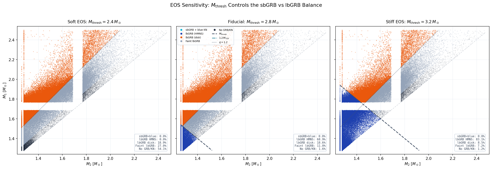 | Three-panel BNS scatter at $M_\mathrm{thresh} = 2.4,\,2.8,\,3.2\,M_\odot$ |

### Part II: Population Synthesis Predictions (Sections 7 to 10)

| Section | Plot | Description |
|---|---|---|
| 7. Mass Distributions | 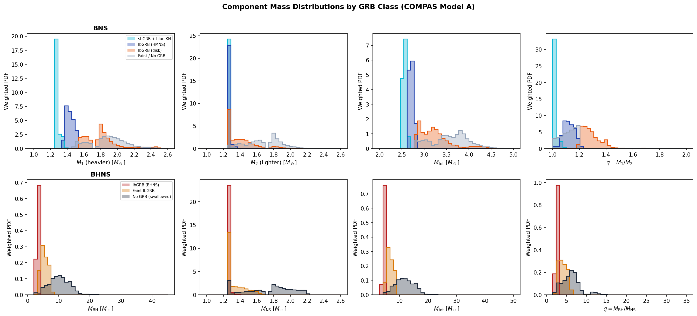 | Weighted histograms of $M_1$, $M_2$, $M_\mathrm{tot}$, $q$ for BNS and BHNS, split by GRB class |
| 8. Delay Times | 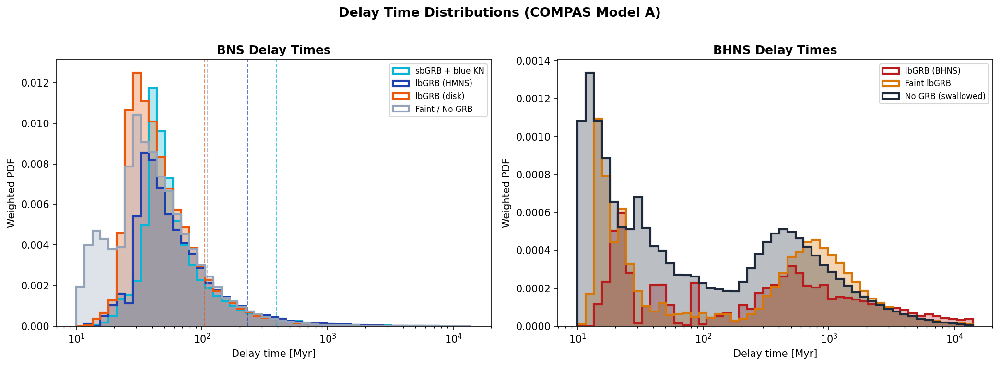 | Delay time distributions by GRB class (BNS vs BHNS, log scale) |
| 9. Metallicity Dependence | 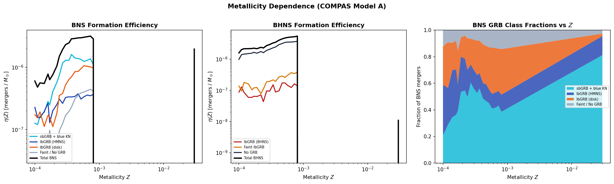 | Formation efficiency vs $Z$, plus GRB class fraction stackplot |
| 10. Formation Channels | 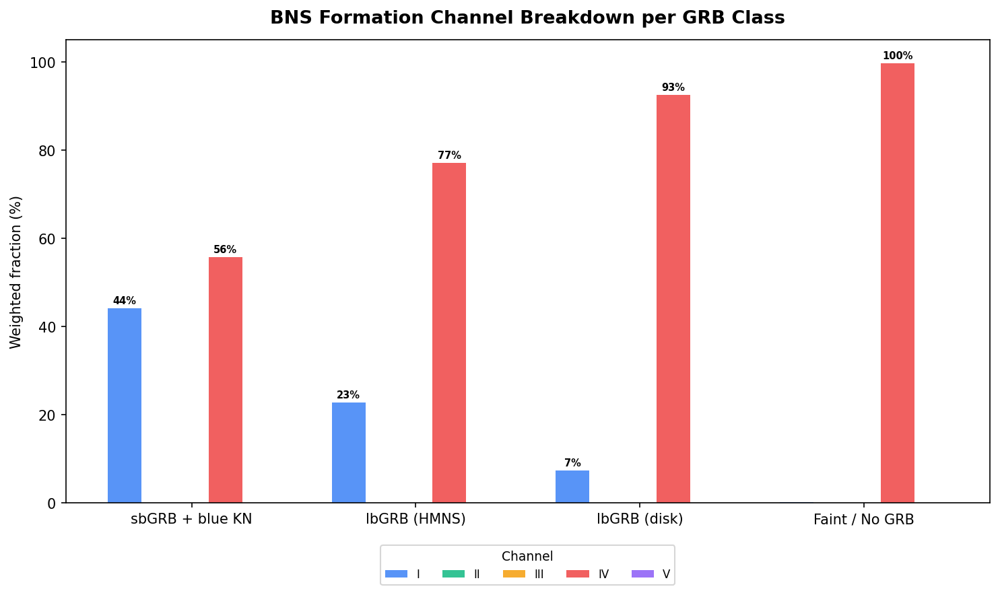 | Broekgaarden channel breakdown (I to V) per BNS GRB class |

### Part III: Cosmic Integration (Sections 11 to 14)

| Section | Plot | Description |
|---|---|---|
| 11. MSSFR Grid | -- | Redshift grid, SFR, metallicity distribution setup via COMPAS FastCosmicIntegration |
| 12. BNS $\mathcal{R}(z)$ | 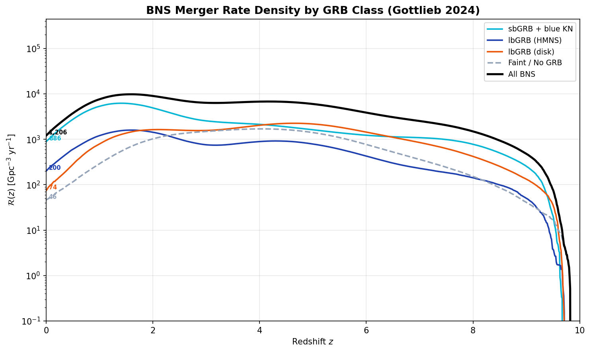 | BNS merger rate density per GRB class vs redshift |
| 13. BHNS $\mathcal{R}(z)$ | 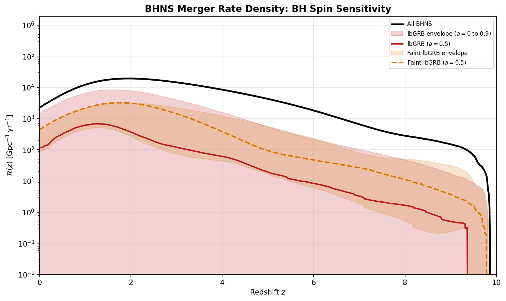 | BHNS merger rate with BH spin sensitivity envelope ($a = 0$ to $0.9$) |
| 14. Combined Summary | 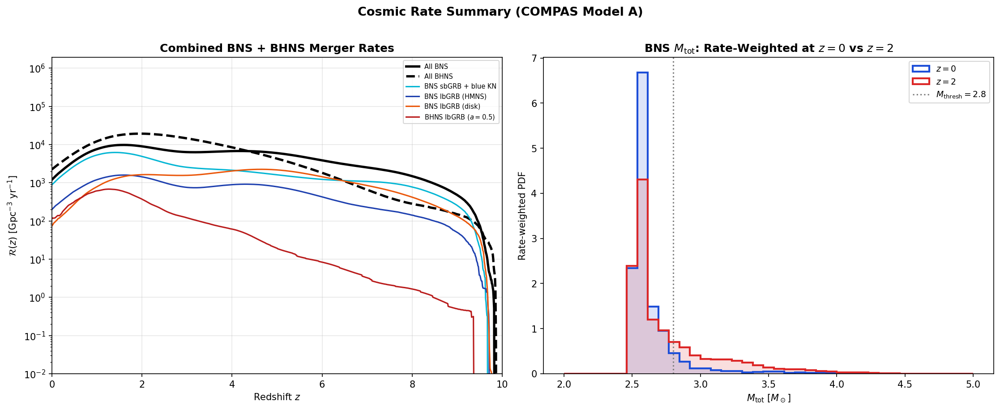 | All BNS + BHNS rates on one axis, plus rate-weighted $M_\mathrm{tot}$ at $z = 0$ vs $z = 2$ |

### Part IV: Kinematic Offsets (Sections 15 to 16b)

| Section | Plot | Description |
|---|---|---|
| 15. Systemic Velocities | 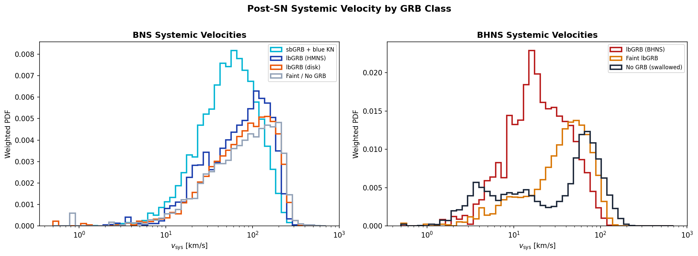 | Post-SN $v_\mathrm{sys}$ distributions by GRB class (BNS vs BHNS) |
| 16. Ballistic Travel Distance | 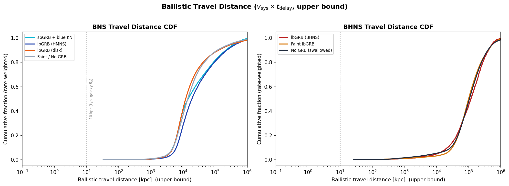 | Ballistic upper-bound travel distance CDFs ($v_\mathrm{sys} \times t_\mathrm{delay}$) |
| 16b. Physical Offsets | 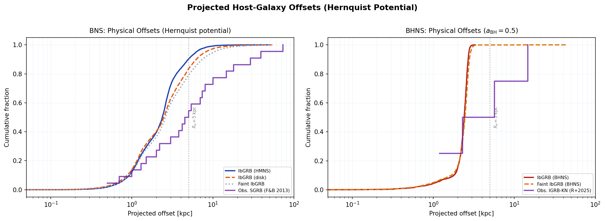 | Orbit-integrated projected offsets using Hernquist galaxy potential, with observed SGRB/lGRB-KN data |

### Part V: Parameter Space Exploration (Sections 17 to 19)

| Section | Plot | Description |
|---|---|---|
| 17. EOS Sensitivity | 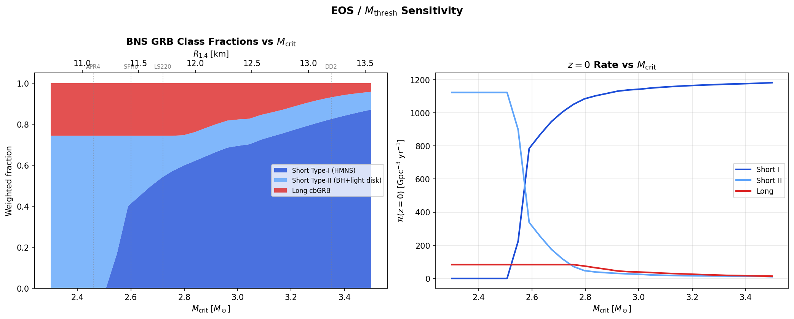 | GRB class fractions and $z = 0$ rates vs $M_\mathrm{crit}$, with $R_{1.4}$ axis and EOS markers |
| 18. BH Spin Exploration | 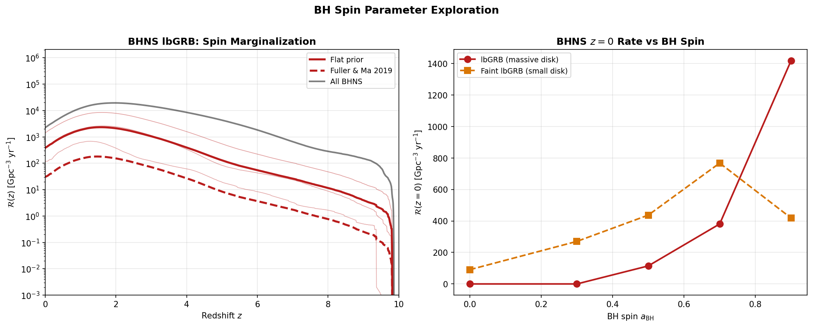 | Spin marginalization (flat vs Fuller and Ma 2019 priors), $\mathcal{R}(z = 0)$ vs $a_\mathrm{BH}$ |
| 19. Model A vs K | 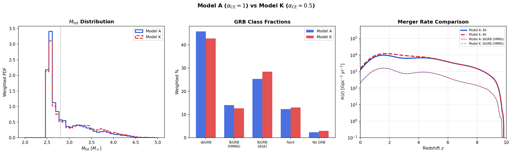 | $\alpha_\mathrm{CE} = 1.0$ vs $0.5$: mass distributions, class fractions, $\mathcal{R}(z)$ comparison |

### Part VI: Summary (Section 20)

Consolidated table of $z = 0$ rates, median masses, delay times, systemic velocities, and projected offsets per GRB class, with key findings.

---

## Classification Scheme

### Gottlieb et al. (2024) BNS (five classes)

| Class | Condition | Engine | KN Color |
|---|---|---|---|
| sbGRB + blue KN | $M_\mathrm{tot} < 1.2\,M_\mathrm{TOV}$ | Long-lived HMNS | Blue |
| lbGRB + red KN (HMNS) | $1.2\,M_\mathrm{TOV} \leq M_\mathrm{tot} < M_\mathrm{thresh}$ | Short-lived HMNS, collapses to BH | Red |
| lbGRB + red KN (disk) | $M_\mathrm{tot} \geq M_\mathrm{thresh}$, $q \geq 1.2$ | Prompt collapse, massive disk | Red |
| Faint lbGRB | $M_\mathrm{tot} \geq M_\mathrm{thresh}$, $1.05 \leq q < 1.2$ | Prompt collapse, small disk | Red |
| No GRB / No KN | $M_\mathrm{tot} \geq M_\mathrm{thresh}$, $q < 1.05$ | Prompt collapse, no disk | -- |

### BHNS (Foucart disk mass)

| Class | Condition |
|---|---|
| No GRB | NS plunges or $M_\mathrm{disk} < 0.01\,M_\odot$ |
| Faint lbGRB + red KN | $0.01 \leq M_\mathrm{disk} < 0.1\,M_\odot$ |
| lbGRB + red KN | $M_\mathrm{disk} \geq 0.1\,M_\odot$ |

Disk mass from [Foucart et al. (2018)](https://arxiv.org/abs/1807.00011) Eq. 4 and 6 with $f_\mathrm{disk} = 0.4$.

---

## Data Sources

- BNS (Model A): [Zenodo 5189849](https://zenodo.org/records/5189849) (`COMPASCompactOutput_BNS_A.h5`)
- BHNS (Model A): [Zenodo 5178777](https://zenodo.org/records/5178777) (`COMPASCompactOutput_BHNS_A.h5`)
- BNS (Model K): [Zenodo 5189849](https://zenodo.org/records/5189849) (`COMPASCompactOutput_BNS_K.h5`)

HDF5 data files are not included in the repository. Download from Zenodo and place in `Data/`.

---

## Setup

```bash
conda create -n grb-env python=3.10
conda activate grb-env
python -m pip install -r requirements.txt
python -m ipykernel install --user --name grb-env --display-name "GRB (grb-env)"
```

---

## References

- Gottlieb et al. (2023): [arXiv:2309.00038](https://arxiv.org/abs/2309.00038)
- Gottlieb et al. (2024): [arXiv:2411.13657v2](https://arxiv.org/abs/2411.13657v2)
- Foucart et al. (2018): [arXiv:1807.00011](https://arxiv.org/abs/1807.00011)
- Foucart (2012): Phys. Rev. D 86, 124007
- Broekgaarden et al. (2021, Paper I): [arXiv:2103.02608](https://arxiv.org/abs/2103.02608)
- Broekgaarden et al. (2022, Paper II): [arXiv:2112.05763](https://arxiv.org/abs/2112.05763)
- Neijssel et al. (2019): Metallicity-specific star formation rate density
- Wanderman and Piran (2010): Long GRB rate and luminosity function
- Fuller and Ma (2019): Natal BH spins in isolated binaries
- Rastinejad et al. (2025): Merger-driven long GRBs and asymmetric compact object binaries
- Hernquist (1990): Analytical model for spherical galaxies and bulges
- Bloom et al. (1999): Host galaxy offset distributions for gamma-ray bursts
- Fong and Berger (2013): Short GRB host galaxies and offsets

---

## License

MIT License. See [LICENSE](LICENSE) for details.
